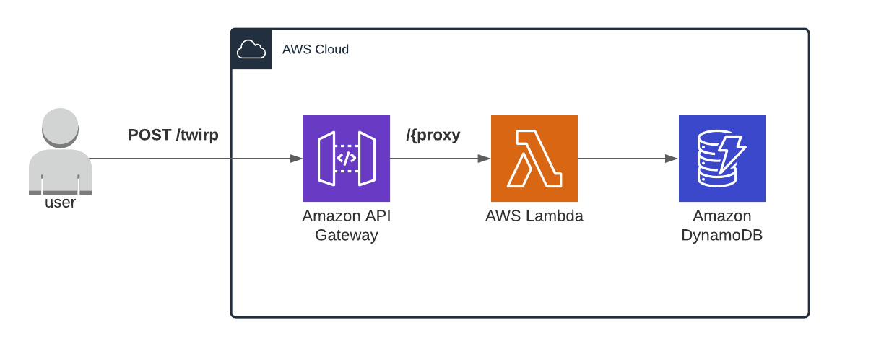

# serverless-twirp

This repo contains a working example of a  Twirp API running on a serverless backend with AWS API Gateway, Lambda and DynamoDB.

Twirp is a Go RPC framework developed by Twitch that uses Protobuf specs - [the Twitch announcement blog post contains more details](https://blog.twitch.tv/en/2018/01/16/twirp-a-sweet-new-rpc-framework-for-go-5f2febbf35f/).

## Why Twirp?

- RPC APIs can be simpler to define than REST APIs
- Code generation for Clients and Servers
- Uses Protobuf specifications for [schema-driven development](https://99designs.com/blog/engineering/schema-driven-development/)
- Twirp avoids some of the complexity of gRPC, like streams
- Uses HTTP 1.1 so works with AWS API Gateway and Lambda

## Why API Gateway & Lambda?

- Lambda only runs in response to requests, meaning it is cheap for sporadic workloads
- Lambda handles autoscaling by default
- Golang compiled binaries are relatively small, meaning faster cold-starts
- API Gateway handles security out of the box with IAM Authentication and lambda authorizers
- API Gateway can be configured to handle metering, throttling and monitoring

## Architecture



## Dependencies:
- AWS CLI
- Docker
- direnv
- Go 1.17
- [buf](https://docs.buf.build/installation/)

## Development

### Tests

```bash
make test
```

## Deployment

The app uses [aws-vault](https://github.com/99designs/aws-vault) to deploy to AWS environments. This can be replaced with local AWS credentials if desired.

First, create a `.envrc` file following the pattern in `.envrc.example`.

Install CDK dependencies:
```
cd _cdk && npm i
```

```
direnv allow .

# bootstrap AWS environment if not already done
make cdk-bootstrap

make cdk-deploy
```

## Design

### API

The API exposes two endpoints:
- `twirp/proto.user.v1.UserService/GetUser`
- `twirp/proto.user.v1.UserService/StoreUser`

Call:

```bash
curl https://{API_ID.execute-api.us-east-1.amazonaws.com/prod/twirp/proto.user.v1.UserService/GetUser \
  -X POST \
  -H 'Content-Type: application/json' \
  -d '{DATA_HERE}'
```

For example:

```bash
curl https://o9muewet11.execute-api.us-east-1.amazonaws.com/prod/twirp/proto.user.v1.UserService/GetUser \
  -X POST \
  -H 'Content-Type: application/json' \
  -d '@testdata/GetUserRequest.json'
```

The endpoints are unauthorized but could be secured with IAM Authentication or JWT tokens.

### DynamoDB

DynamoDB is used for storage as it's quick, scalable and integrates well with AWS Lambda. The table follows [the single-table design pattern](https://www.alexdebrie.com/posts/dynamodb-single-table/) with generic partition and sort keys.

For Users, the keys are:
- `Partition Key`: `ORG#{ORG_ID}`
- `Sort Key`: `USER#{USER_ID}`

Which supports the access patterns:
- Get all users in an organisation
- Get a specific user

The data model stored is:


## Solution Drawbacks

- Twirp uses `POST` for requests meaning [API Gateway can't cache requests](https://docs.aws.amazon.com/apigateway/latest/developerguide/api-gateway-caching.html)
- Golang lacks a strong ORM for DynamoDB

## References

- [Twirp blog post](https://blog.twitch.tv/en/2018/01/16/twirp-a-sweet-new-rpc-framework-for-go-5f2febbf35f/)
- [Alex DeBrie DynamoDB blog](https://www.alexdebrie.com/posts/dynamodb-no-bad-queries/)
- [DynamoDB AWS Go V2 cheatsheet](https://dynobase.dev/dynamodb-golang-query-examples/)
